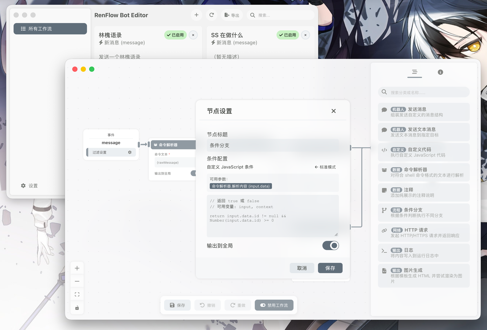

  
  <h2 align="center" style="font-weight: 600">Renflow Bot</h2>
  

    用工作流来创建机器人逻辑
     <a href="https://github.com/Stapxs/Renflow-Bot/releases" target="blank"><strong>📦️ 下载程序</strong></a>&nbsp;&nbsp;|&nbsp;&nbsp;
    <a href="https://github.com/Stapxs/Renflow-Bot/issues/new" target="blank"><strong>💬 反馈问题</strong></a>
     
     
    <strong>本网页应用仅供学习交流使用，请勿用于其他用途</strong>
  

## 早期项目
Renflow Bot 当前处在早期开发阶段，功能尚不完善，欢迎测试与反馈。相关文档与使用说明逐步完善中。

## 📜 额外依赖声明
Renflow Bot 的 Tauri 版本使用了来自 [DeltaChat](https://github.com/deltachat/deltachat-desktop) 项目的 user-notify 代码，用于提供跨平台系统通知功能。由于这部分代码没有独立发布，我们将其源码复制到了 `src/tauri/crates/user-notify` 目录下。此部分代码已通过 .gitattributes 文件排除在语言统计之外。
